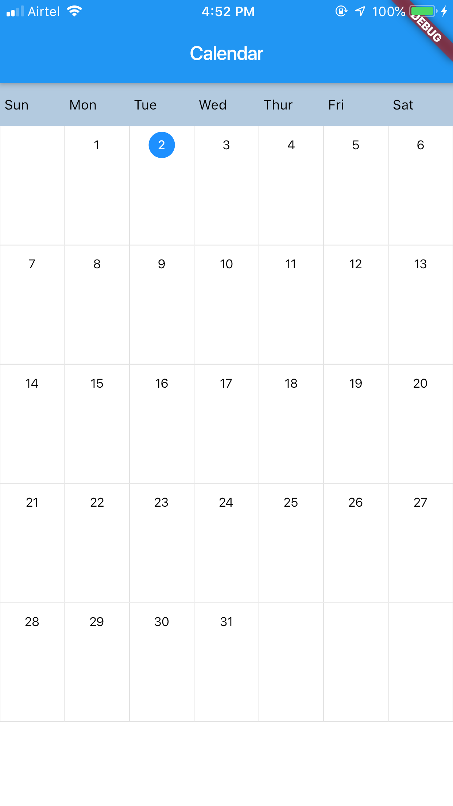
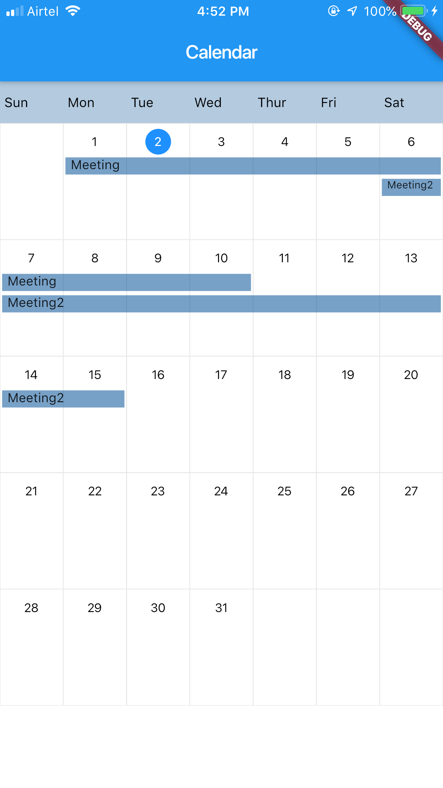

# flutter_calendar

A new Flutter package project for displaying calendar and the events that are happening currently.

## Getting Started

Add the flutter_calendar dependency to your pubspec.yaml

Add it as a child to any Widget, send size to the widget, by default it occupies the screen width and height

Set the list of events by using static method setListAndUpdateMap present in CalendarEvent class in calender_event.dart file

To add the calendar widget you just need to add below line of code

`CustomCalendar()` as a child

Example:
```
Container(
  child:CustomCalendar(),
);
```

Then you will see the UI as below:




If you want to add the events, you need to first set the list of events then build the widget which has CustomCalendar as child(this can be found in example):

```
void setCalendarEvents(){
    List<CalendarEvent> eventsList = List<CalendarEvent>();

    CalendarEvent event = CalendarEvent();
    event.title = "Meeting";
    event.startTime = DateTime(2019,07,01);
    event.endTime = DateTime(2019,07,10);
    eventsList.add(event);

    event = CalendarEvent();
    event.title = "Meeting2";
    event.startTime = DateTime(2019,07,06);
    event.endTime = DateTime(2019,07,15);
    eventsList.add(event);
    CalendarEvent.setListAndUpdateMap(eventsList);
  }
```

UI with events would look like:


